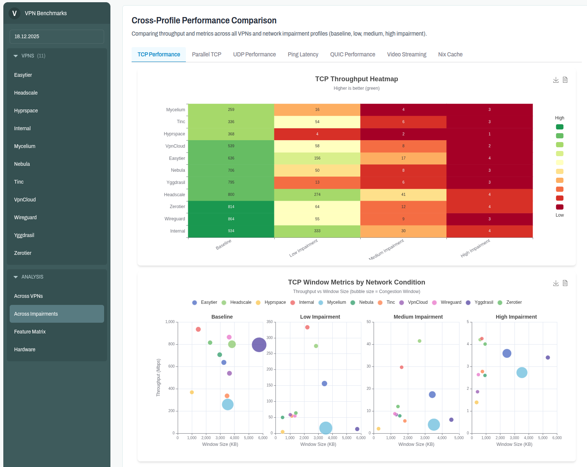
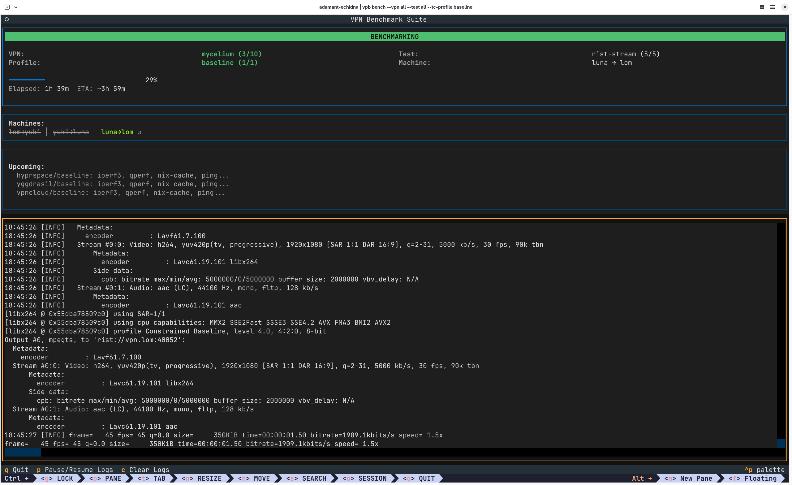

# VPN Benchmark Tooling

A fully automated and reproducible benchmark for Peer-to-Peer Mesh VPNs. 
Current benchmark results can be viewed at https://vpnbench.clan.lol/overview

## Screenshots






## Development Setup

Let's get your development environment up and running:

1. **Install Nix Package Manager**:

      - You can install the Nix package manager by either [downloading the Nix installer](https://github.com/DeterminateSystems/nix-installer/releases) or running this command:
        ```bash
        curl --proto '=https' --tlsv1.2 -sSf -L https://install.determinate.systems/nix | sh -s -- install
        ```

2. **Install direnv**:

      - To automatically setup a devshell on entering the directory
        ```bash
        nix profile install nixpkgs#nix-direnv-flakes nixpkgs#direnv
        ```

3. **Add direnv to your shell**:

      - Direnv needs to [hook into your shell](https://direnv.net/docs/hook.html) to work.
        You can do this by executing following command. The example below will setup direnv for `zsh` and `bash`

      ```bash
      echo 'eval "$(direnv hook zsh)"' >> ~/.zshrc && echo 'eval "$(direnv hook bash)"' >> ~/.bashrc && eval "$SHELL"
      ```

4. **Allow the devshell**
      - Clone the repository
      ```bash
      git clone https://git.clan.lol/Qubasa/vpn-benchmark.git
      ```
      - Allow the devshell by
      ```bash
        $ cd `vpn-benchmark/pkgs/vpn-bench`
        $ direnv allow
      ```

6. **(Optional) Hetzner Credentials**
    - For development I recommend setting the env var `TF_VAR_hcloud_token` with the token gathered from
    [generating-api-token](https://docs.hetzner.com/cloud/api/getting-started/generating-api-token/)

    - You can create a `vpn-benchmark/pkgs/vpn-bench/.local.env` where you can add bash commands and
      and exports like:
        ```bash
        export TF_VAR_hcloud_token=$(rbw get "hetzner benchmark space API key")
        ```

## Benchmarking on Hetzner Cloud VMs

Hetzner VMs are good for developing, as they are easy to spin up and tier down, 
for actual benchmarks however, they are not very well suited as the VMs share a common network card.


Create the VMs:

```bash
cd pkgs/vpn-bench
vpb create --provider hetzner
```

Install the VMs:
```bash
vpb install
```

Start benchmarking:

```bash
vpb bench
```

## Benchmarking on Hetzner Hardware

This should be used to get reliable benchmark data, as here every machine has it's own network card.

Rent yourself (at least) three machines that have similiar hardware, that are in the same region.

To create the configuration execute:

```bash
vpb create --provider hardware --host "root@138.201.33.111:lom" --host "root@138.201.51.119:yuki" --host "root@88.99.103.93:luna" --debug
```

You can inspect `~/.local/share/vpn_bench` for the newly created files.


This will use kexec to install the Hetzner machines. 
Note that kexec can crash and be non recoverable.
This depends on the hardware, some hardware works with kexec some doesn't, 
this will be a trial and error process, till the correct hardware has been found.

```bash
vpb install --provider hardware
```


This will start the benchmark, with all tests and all vpns.

```bash
vpb bench --test all --vpn all
```